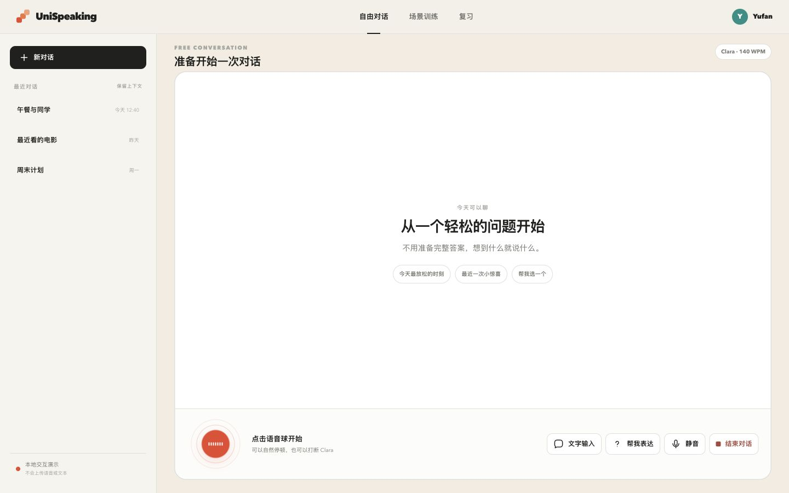
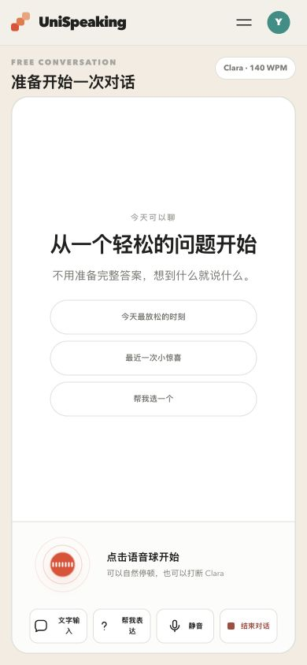
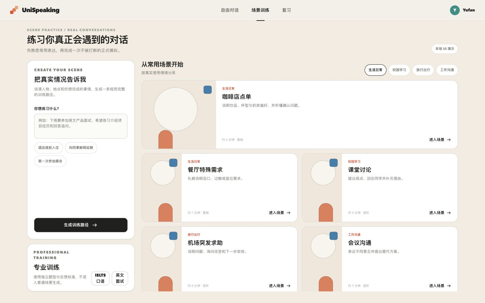
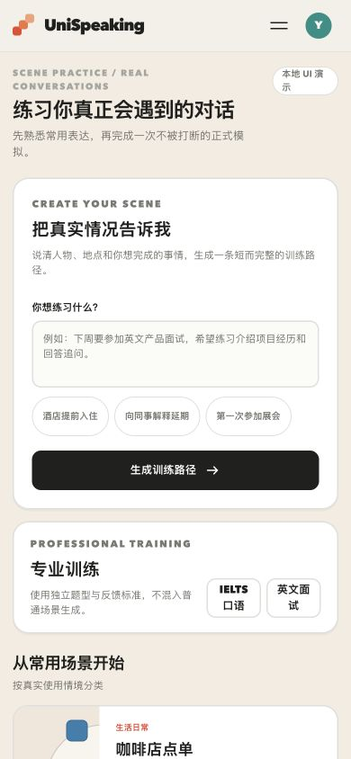
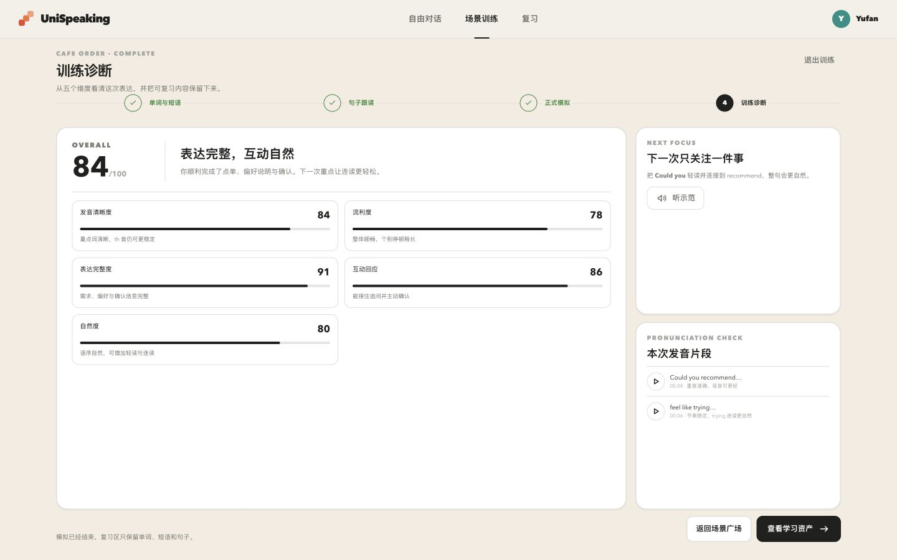
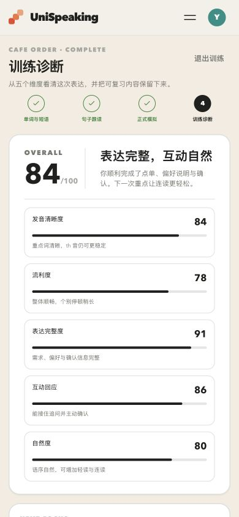

# UniSpeaking Web / Mobile 产品原型图

本轮原型围绕三条核心产品路径整理，Web 端与移动端各提供 3 张界面，用于对照检查跨端的信息层级、功能入口与训练流程。

## 1. 自由对话

提供低压力的英语开口入口。Web 端保留最近对话记录，移动端聚焦语音启动与核心控制。

### Web 端

### 移动端

## 2. 场景训练

支持自定义训练场景、常用生活场景与专业训练入口。完整训练流程依次为：单词短语跟读、句子跟读、场景模拟、训练诊断。

### Web 端

### 移动端

## 3. 训练诊断

训练结束后展示总分、发音清晰度、流利度、表达完整度、互动回应和自然度。场景模拟完成后不支持直接重复模拟，仅支持针对单词、短语和句子的重新跟读练习。

### Web 端

### 移动端

## 原型规格

- Web：1440 × 900
- Mobile：390 × 844
- 页面数量：Web 3 张、Mobile 3 张，共 6 张
- 对应产品设计讨论：[Issue #1](https://github.com/1024XEngineer/UniSpeaking/issues/1)
