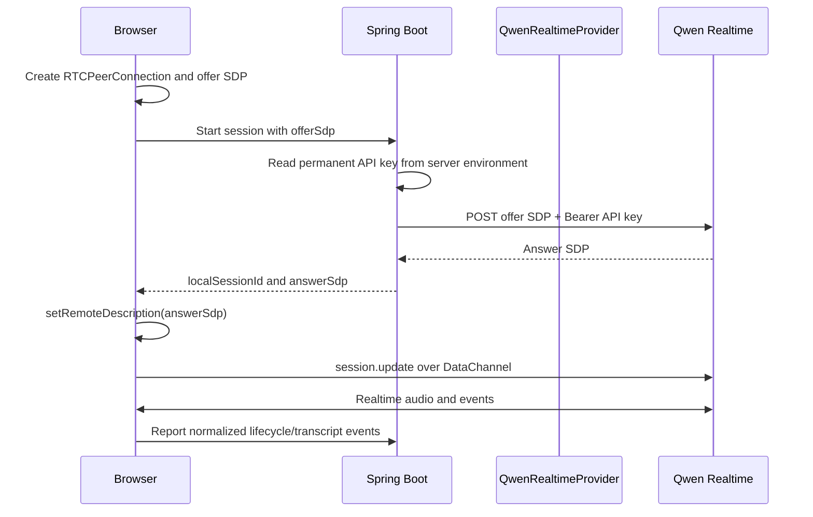

# Realtime sequence

For Alibaba Model Studio WebRTC, the permanent API key stays on the Spring
server and authenticates the SDP exchange directly. There is no temporary-token
exchange in this protocol. Alibaba's AOQ protocol is a different flow: its
gateway returns an `aoqTokenForClient` that the native client uses to connect.
