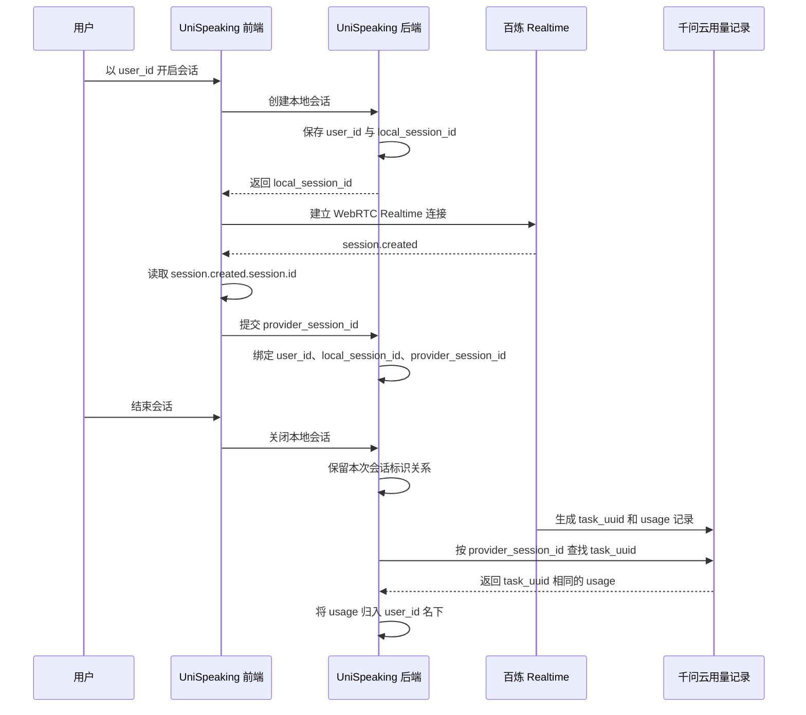

# 用户会话标识与用量归属流程

> 当前开发阶段尚未接入登录、数据库和云端用量查询。本文件中的
> `AuthContext`、`SessionRepository` 和云端查询代码仍是目标流程伪代码。
> 现有服务在缺少 `userId` 时使用 `local-demo-user`，会话及用户 memory
> 暂存在进程内存中，重启后丢失。

## 核心关系

一次会话的完整归属关系是：

```text
用户 ID
  -> UniSpeaking 本地会话 ID
  -> 百炼 session.created.session.id
  -> 千问云用量记录 task_uuid
  -> 该次会话的 usage
  -> 归入用户 ID 名下
```

本次实测结果：

```text
user_id: demo-user-001
local_session_id: 3a957e96064445babdf00d05cb418110
provider_session_id: sess_CQEnIAvxbwqto5CFOIoEh
千问云 task_uuid: sess_CQEnIAvxbwqto5CFOIoEh
```

`provider_session_id` 与千问云记录中的 `task_uuid` 完全一致，因此可以用它把千问云产生的会话用量记录归入对应用户。

## 这个标识从哪里获取

`provider_session_id` 不是 UniSpeaking 前端生成的，也不是 UniSpeaking 后端生成的。

浏览器完成 WebRTC 连接后，百炼 Realtime 服务会主动发送本次连接的 `session.created` 事件。事件中包含百炼为本次会话生成的唯一会话标识：

```json
{
  "type": "session.created",
  "session": {
    "id": "sess_CQEnIAvxbwqto5CFOIoEh"
  }
}
```

UniSpeaking 从下面这个字段取得标识：

```text
session.created.session.id
```

在当前 Demo 中，这个值被命名为：

```text
provider_session_id
```

## 从开启会话到用量归属的完整过程



## 伪代码流程

### 原始伪代码版本

```java
// 用户点击开始自由聊天
User user = AuthContext.getCurrentUser()

Client.startFreeChat(
        StartFreeChatRequest.builder()
            .setUserId(
                user.getId()
            )
            .build()
)

// UniSpeaking 后端创建本地会话，并立即归到当前用户下
LocalSession localSession =
        LocalSessionFactory.create(
                LocalSessionRequest.builder()
                    .setUserId(
                        user.getId()
                    )
                    .setSceneType(
                        SceneType.FREE_CHAT
                    )
                    .build()
        )

// 此时系统已经保存第一层关系
SessionRepository.save(
        SessionRecord.builder()
            .setUserId(
                user.getId()
            )
            .setLocalSessionId(
                localSession.getId()
            )
            .build()
)

// 前端使用本地会话 ID 建立百炼 Realtime WebRTC 连接
RealtimeConnection connection =
        QwenRealtimeClient.connect(
                RealtimeConnectRequest.builder()
                    .setLocalSessionId(
                        localSession.getId()
                    )
                    .build()
        )

// 百炼成功创建会话后，主动发送 session.created 事件
connection.onEvent(event -> {
    if (event.getType() == EventType.SESSION_CREATED) {

        // 这个 ID 由百炼生成，不是 UniSpeaking 自己生成
        String providerSessionId =
                event.getSession().getId()

        // 实际值示例：sess_CQEnIAvxbwqto5CFOIoEh

        // 前端把百炼会话 ID 提交给 UniSpeaking 后端
        Client.bindProviderSession(
                BindProviderSessionRequest.builder()
                    .setLocalSessionId(
                        localSession.getId()
                    )
                    .setProviderSessionId(
                        providerSessionId
                    )
                    .build()
        )
    }
})

// 后端根据 local_session_id 找到已经绑定的用户
BindProviderSessionRequest bindRequest =
        Server.receiveBindProviderSessionRequest()

SessionRecord sessionRecord =
        SessionRepository.findByLocalSessionId(
                bindRequest.getLocalSessionId()
        )

// 保存完整的用户与百炼会话关系
sessionRecord.setProviderSessionId(
        bindRequest.getProviderSessionId()
)

SessionRepository.save(
        sessionRecord
)

// 此时保存的关系为：
// user_id
//     -> local_session_id
//     -> provider_session_id


// 用户点击结束自由聊天，前端先确保 provider_session_id 已经绑定完成
Client.waitForProviderSessionBinding(
        localSession.getId()
)

Client.endFreeChat(
        EndFreeChatRequest.builder()
            .setLocalSessionId(
                localSession.getId()
            )
            .build()
)

// 后端关闭本地会话，但保留用户与 provider_session_id 的关系
SessionService.closeSession(
        localSession.getId()
)


// 千问云在会话结束后异步生成用量记录
// 因此系统可以延迟执行，不需要实时查询
UsageRecord cloudUsageRecord =
        QwenUsageLogService.findByTaskUuid(
                sessionRecord.getProviderSessionId()
        )

// 核对千问云 task_uuid 与本地保存的 provider_session_id
if (cloudUsageRecord.getTaskUuid().equals(
        sessionRecord.getProviderSessionId()
)) {

    // 匹配成功后，将本次会话用量归入对应用户
    UserUsageRecord userUsageRecord =
            UserUsageRecord.builder()
                .setUserId(
                    sessionRecord.getUserId()
                )
                .setLocalSessionId(
                    sessionRecord.getLocalSessionId()
                )
                .setProviderSessionId(
                    sessionRecord.getProviderSessionId()
                )
                .setTaskUuid(
                    cloudUsageRecord.getTaskUuid()
                )
                .setUsage(
                    cloudUsageRecord.getUsage()
                )
                .build()

    UserUsageRepository.save(
            userUsageRecord
    )
}

// 最终归属结果：
// task_uuid
//     == provider_session_id
//     -> local_session_id
//     -> user_id
//     -> usage 归入该用户
```

### 逐行注释版本

阅读时只需要从上往下看。每行右侧的 `//` 都是在解释这一行为什么存在。

```java
// ===== 第一阶段：用户开始会话 =====
User user = AuthContext.getCurrentUser(); // 取得当前已经登录的用户，后面的会话和用量都要归到这个用户下。
String userId = user.getId(); // 取出用户唯一 ID；本次测试中它是 demo-user-001。
StartFreeChatRequest startRequest = new StartFreeChatRequest(userId); // 创建“开始自由聊天”请求，并把用户 ID 放进去。
Client.startFreeChat(startRequest); // 前端把开始请求发送给 UniSpeaking 后端。

// ===== 第二阶段：UniSpeaking 创建自己的本地会话 =====
LocalSession localSession = LocalSessionFactory.create(userId); // 后端创建一条自己的会话记录，并在创建时绑定当前用户。
String localSessionId = localSession.getId(); // 取得 UniSpeaking 自己生成的本地会话 ID。
SessionRecord sessionRecord = new SessionRecord(); // 新建一条用于保存“用户与会话关系”的记录。
sessionRecord.setUserId(userId); // 在记录中保存：这次会话属于哪个用户。
sessionRecord.setLocalSessionId(localSessionId); // 在记录中保存：UniSpeaking 内部的会话 ID 是什么。
SessionRepository.save(sessionRecord); // 把 user_id 和 local_session_id 的第一层关系保存起来。

// ===== 第三阶段：连接百炼 Realtime 服务 =====
RealtimeConnection connection = QwenRealtimeClient.connect(localSessionId); // 前端通过 WebRTC 建立与百炼 Realtime 的连接。
connection.onEvent(event -> { // 注册事件监听器；百炼每发送一个事件，下面的代码就会检查一次。
    if (event.getType() == EventType.SESSION_CREATED) { // 只处理百炼发来的 session.created 事件。
        String providerSessionId = event.getSession().getId(); // 从 session.created.session.id 取得百炼生成的唯一会话 ID。
        // 上一行实际取得：sess_CQEnIAvxbwqto5CFOIoEh。
        BindProviderSessionRequest bindRequest = new BindProviderSessionRequest(); // 创建一条“绑定百炼会话 ID”的请求。
        bindRequest.setLocalSessionId(localSessionId); // 告诉后端：这个百炼 ID 对应哪一条 UniSpeaking 本地会话。
        bindRequest.setProviderSessionId(providerSessionId); // 把刚从 session.created 中取得的百炼会话 ID 放入请求。
        Client.bindProviderSession(bindRequest); // 前端把 local_session_id 和 provider_session_id 一起提交给后端。
    } // session.created 事件处理结束。
}); // 百炼事件监听器注册完成。

// ===== 第四阶段：后端把百炼会话 ID 绑定到用户 =====
BindProviderSessionRequest bindRequest = Server.receiveBindProviderSessionRequest(); // 后端接收前端提交的绑定请求。
String receivedLocalSessionId = bindRequest.getLocalSessionId(); // 从请求中取得 UniSpeaking 本地会话 ID。
String receivedProviderSessionId = bindRequest.getProviderSessionId(); // 从请求中取得百炼 session.created.session.id。
SessionRecord boundSession = SessionRepository.findByLocalSessionId(receivedLocalSessionId); // 用本地会话 ID 找回之前已经绑定用户的会话记录。
boundSession.setProviderSessionId(receivedProviderSessionId); // 把百炼会话 ID 补充到同一条用户会话记录中。
SessionRepository.save(boundSession); // 保存完整关系：user_id -> local_session_id -> provider_session_id。

// ===== 第五阶段：用户结束会话 =====
Client.waitForProviderSessionBinding(localSessionId); // 结束前先等待绑定请求完成，避免会话关闭太快而丢失 provider_session_id。
EndFreeChatRequest endRequest = new EndFreeChatRequest(localSessionId); // 创建“结束自由聊天”请求，并指出要结束哪条本地会话。
Client.endFreeChat(endRequest); // 前端把结束请求发送给 UniSpeaking 后端。
SessionService.closeSession(localSessionId); // 后端关闭本次会话，但继续保留用户与 provider_session_id 的对应关系。

// ===== 第六阶段：千问云生成用量后再进行匹配 =====
String savedProviderSessionId = boundSession.getProviderSessionId(); // 从用户会话记录中取出之前保存的百炼会话 ID。
UsageRecord cloudUsageRecord = QwenUsageLogService.findByTaskUuid(savedProviderSessionId); // 用 provider_session_id 查询 task_uuid 相同的千问云用量记录。
String cloudTaskUuid = cloudUsageRecord.getTaskUuid(); // 从千问云用量记录中取出 task_uuid。
Usage cloudUsage = cloudUsageRecord.getUsage(); // 从同一条千问云记录中取出本次会话的 usage 数据。

// ===== 第七阶段：确认标识一致并把用量归到用户 =====
if (cloudTaskUuid.equals(savedProviderSessionId)) { // 只有 task_uuid 与 provider_session_id 完全相等时，才认定是同一次会话。
    UserUsageRecord userUsageRecord = new UserUsageRecord(); // 新建一条“用户用量记录”。
    userUsageRecord.setUserId(boundSession.getUserId()); // 写入用户 ID，明确这些用量归谁所有。
    userUsageRecord.setLocalSessionId(boundSession.getLocalSessionId()); // 写入 UniSpeaking 本地会话 ID，方便内部追踪。
    userUsageRecord.setProviderSessionId(savedProviderSessionId); // 写入百炼会话 ID，保留与千问云记录的匹配依据。
    userUsageRecord.setTaskUuid(cloudTaskUuid); // 写入千问云 task_uuid，记录本次匹配到的云端标识。
    userUsageRecord.setUsage(cloudUsage); // 写入千问云返回的本次会话实际用量。
    UserUsageRepository.save(userUsageRecord); // 保存最终结果，把这次会话用量正式归入该用户名下。
} // 本次标识匹配和用户用量归属处理结束。

// 最终关系：task_uuid == provider_session_id -> local_session_id -> user_id -> usage 归入该用户。
```

### 1. 用户开启会话

用户进入 UniSpeaking 并开始对话时，系统已经知道当前用户的 `user_id`。

当前 Demo 使用的测试用户是：

```text
demo-user-001
```

后端创建一条本地会话，并立即把本地会话归到这个用户下：

```text
user_id: demo-user-001
local_session_id: 3a957e96064445babdf00d05cb418110
```

此时只建立了 UniSpeaking 内部的用户与本地会话关系，还没有取得百炼会话 ID。

### 2. 百炼创建 Realtime 会话

浏览器通过 UniSpeaking 后端完成 SDP 交换，建立与百炼 Realtime 服务的 WebRTC 连接。

连接创建成功后，百炼主动向浏览器发送：

```text
session.created
```

浏览器从事件中读取：

```javascript
obj.session?.id
```

本次实际读取到：

```text
sess_CQEnIAvxbwqto5CFOIoEh
```

### 3. 将百炼会话 ID 绑定到用户会话

浏览器取得 `session.created.session.id` 后，立即将它提交给 UniSpeaking 后端：

```text
POST /api/sessions/{local_session_id}/provider-session
```

提交内容为：

```json
{
  "provider_session_id": "sess_CQEnIAvxbwqto5CFOIoEh"
}
```

后端通过 `local_session_id` 找到创建会话时已经绑定的用户，然后保存完整关系：

| user_id | local_session_id | provider_session_id |
|---|---|---|
| `demo-user-001` | `3a957e96064445babdf00d05cb418110` | `sess_CQEnIAvxbwqto5CFOIoEh` |

到这里，系统已经知道百炼会话 `sess_CQEnIAvxbwqto5CFOIoEh` 属于用户 `demo-user-001`。

### 4. 用户结束会话

用户点击结束后，前端先等待 `provider_session_id` 的绑定请求完成，再请求后端关闭本地会话。

后端在关闭时保留以下关系：

```text
demo-user-001
  -> 3a957e96064445babdf00d05cb418110
  -> sess_CQEnIAvxbwqto5CFOIoEh
```

当前 Demo 将这份关系写入：

```text
/Users/mac/Documents/七牛云/7.14/UniSpeaking/data/last_session_identity.txt
```

### 5. 千问云生成用量记录

会话结束后，千问云异步生成本次会话的用量记录。记录中包含：

```json
{
  "task_uuid": "sess_CQEnIAvxbwqto5CFOIoEh",
  "usage": {
    "本次会话的用量字段": "..."
  }
}
```

其中：

```text
task_uuid == provider_session_id
```

本次已经实际确认：

```text
sess_CQEnIAvxbwqto5CFOIoEh == sess_CQEnIAvxbwqto5CFOIoEh
```

### 6. 将用量记录归到用户下

千问云用量记录生成后，系统使用已经保存在用户会话下的 `provider_session_id` 查找千问云记录：

```text
查找条件：
task_uuid = sess_CQEnIAvxbwqto5CFOIoEh
```

找到记录后，沿着之前保存的关系反查用户：

```text
task_uuid
  = provider_session_id
  -> local_session_id
  -> user_id
```

最终结果：

```text
千问云中 task_uuid 为 sess_CQEnIAvxbwqto5CFOIoEh 的全部会话用量
归入用户 demo-user-001 名下
```

因此，每次会话只需要保存下面三个字段，就可以在会话结束后完成用量归属：

| 必须保存的字段 | 作用 |
|---|---|
| `user_id` | 表示会话属于哪个用户 |
| `local_session_id` | 表示 UniSpeaking 内部的本地会话 |
| `provider_session_id` | 用来匹配千问云记录中的 `task_uuid` |
